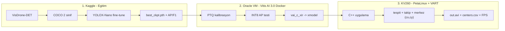

# KV260 + YOLOX-Nano: Havadan Araç Tespiti ve Merkez Noktası

Dört havadan-görüntü veri setinden birleştirilmiş bir setle fine-tune edilen
**DPU-uyumlu YOLOX-Nano** modelini Vitis AI 3.0 ile kuantalayıp **Kria KV260**
üzerinde (PetaLinux + VART, C++) video dosyasından **kara ve deniz aracı**
tespiti yapan, her tespitin **merkez noktasını (cx, cy)** hesaplayıp
çizen/loglayan uçtan uca proje.

**Hedef çalışma noktası:** 2 sınıf (`land_vehicle`, `sea_vehicle`), 896×512
girdi, ≥30 FPS, takip ile iz bazında yüksek recall.

## Veri kaynakları

| Kaynak | Format | Katkı |
| --- | --- | --- |
| VisDrone2019-DET | yerel txt | `land_vehicle`: car, van, truck, bus |
| Mendeley UAV Military | YOLO txt | `land_vehicle`: tank |
| Military Vehicle Recognition | Roboflow COCO | `land_vehicle`: tank, APC |
| VESSELimg | Roboflow COCO | `sea_vehicle`: container, chemical, ro-ro, tugboat |

`tools/build_dataset.py` dördünü tek bir 2 sınıflı COCO setinde birleştirir:
sınıf eşlemesi, ignore işaretleme, **oturum bazlı** train/val bölmesi ve sert
doğrulama kapıları içerir. Sonuç: **19.476 train / 4.483 val görüntü**.



## Klasör yapısı

| Yol | İçerik |
| --- | --- |
| `tools/build_dataset.py` | Dört kaynağı tek 2 sınıflı COCO'ya birleştirir; sınıf eşlemesi, oturum bazlı bölme, doğrulama kapıları |
| `tools/verify_kv260_golden.py` | Kartın ham INT8 çıktılarında Python ↔ C++ decode/NMS/merkez eşdeğerlik testi |
| `training/visdrone_eval.py` | Resmi DET toolkit eşleştirmesi + VOC AP (global top-500), ayrıca P/R/F1 ve sınıf gruplama senaryoları |
| `training/kaggle_visdrone_yolox.ipynb` | Kaggle not defteri: kurulum → veri → eğitim → metrikler → tiling ölçümü → paketleme |
| `training/exps/yolox_nano_visdrone.py` | DPU-uyumlu YOLOX-Nano deney dosyası (ReLU + DPUFocus, 896×512, 2 sınıf) |
| `quantize/README.md` | Oracle VM + Vitis AI 3.0 docker kurulum ve kuantalama rehberi |
| `quantize/quantize_yolox.py` | PTQ kalibrasyon / INT8 AP / xmodel export / DPU inspector |
| `quantize/compile_kv260.sh` | KV260 için derleme + subgraph doğrulama (kanal sayısı sınıf sayısından türetilir) |
| `deploy/README.md` | KV260 kart kurulumu, derleme ve çalıştırma rehberi |
| `deploy/src/main.cpp` | C++ VART uygulaması (video → tespit → takip → merkez → çizim + CSV + FPS) |
| `deploy/src/tracker.hpp` | IoU tabanlı takip (ByteTrack iki aşamalı eşleştirme, sabit hız). VART/OpenCV bağımsız — kart dışında test edilir |
| `docs/report_template.md` | Doldurulacak proje raporu şablonu |

## Uygulama sırası

1. **Kaggle** — `training/kaggle_visdrone_yolox.ipynb` (GPU + Internet açık).
   Veri birleştirmeden eğitime, metriklere ve `yolox_aerial_artifacts.zip`
   paketine kadar her şeyi yapar.
   Beklenen süre: 40 epoch için ~1,5-2 saat (T4).
2. **Oracle VM** — [quantize/README.md](quantize/README.md): docker kurulumu →
   PTQ kalibrasyon → INT8 AP → xmodel export → `compile_kv260.sh`.
   Çıktı: `yolox_nano_visdrone.xmodel`.
3. **KV260** — [deploy/README.md](deploy/README.md): SD imaj → dosya kopyalama →
   `build.sh` → golden eşdeğerlik testi → demo. Çıktı: `out.avi`,
   `centers.csv`, FPS özeti.
4. **Rapor** — Ölçümleri [docs/report_template.md](docs/report_template.md)
   şablonuna işleyin.

## Kritik teknik kararlar

- **2 sınıf: `land_vehicle` / `sea_vehicle`**. Görsel olarak benzeyen sınıflar
  birleştirilir (car/van/truck/bus/tank aynı sınıf; container/tanker/tugboat
  aynı sınıf), benzemeyenler atılır (bisiklet, motosiklet, insan, hava aracı).
  Ölçüt [arXiv 2407.00018](https://arxiv.org/abs/2407.00018): benzer sınıfları
  birleştirmek yardım eder, farklı olanları birleştirmek zarar verir.
  Kategori sayısı hem eğitim hem değerlendirme setinde doğrulanır — eski şemalı
  JSON diskte kalırsa eğitim sessizce bozulmak yerine hata verip durur.
- **Kaynak bölmeleri yeniden yapılır.** Üç Roboflow kaynağının hepsi bölmeyi
  kare/kopya bazında yapmış: VESSELimg'in 23 çekim oturumunun tamamı
  train/valid/test'te birden, diğer ikisinde aynı görüntünün augment kopyaları
  farklı bölümlerde. Bu haliyle doğrulama skoru şişik çıkardı. Bölme artık
  **oturum bazlı**; doğrulama kapısı sızıntı bulursa dosya üretilmez.
- **Girdi 896×512 (16:9)**. 1920×1080 kareyi 640×640'a letterbox etmek
  kanvasın **%44'ünü gri dolguya** harcar ve etkin ölçek 0.333'te kalır.
  896×512 aynı kareyi 0.467 ölçekle işler: %12 daha fazla hesapla **%40 daha
  yüksek çözünürlük**. Küçük nesne recall'unun en ucuz kaldıracı budur
  (2×2 tiling %67 kazanç için 5 kat hesap ister).
- **Sürüm sabitleme**: KV260'ın son hazır SD imajı Vitis AI **3.0** olduğundan
  docker imajı `xilinx/vitis-ai-pytorch-cpu:ubuntu2004-3.0.0.106`
  (`:latest` = 3.5, kullanmayın). Kaggle ve VM aynı YOLOX commit'ini
  (`6ddff4824372906469a7fae2dc3206c7aa4bbaee`) kullanır.
- **VisDrone değerlendirmesi**: `category=0` ignored-region alanları korunur ve
  eğitimde maskelenir; `others` hedef sınıflara alınmaz. AP, resmi
  `calcAccuracy.m` ile birebir aynı mantığı kullanır — ignore GT'ler recall
  paydasında kalır. Ek olarak P/R/F1 raporlanır; F1'in recall paydası
  yayınlanmış YOLO sonuçlarıyla kıyaslanabilsin diye ignore GT'leri **saymaz**.
- **SiLU → ReLU**: DPUCZDX8G SiLU'yu desteklemez.
- **Focus → DPUFocus**: Focus'un strided-slice'ı DPU'da çalışmaz. Sabit
  one-hot ağırlıklı 2×2/stride-2 conv aynı space-to-depth işlemini birebir
  üretir ve önceden eğitilmiş ağırlıklar geçerli kalır.
- **Ham baş çıktıları**: Sigmoid/grid çözümü DPU dışında yapılır. C++ tarafında
  sigmoid/exp INT8 için 256 girişli LUT'larla hesaplanır; objectness eşiği ham
  int8 değeriyle uygulanır.
- **Takip + düşük güven eşiği (0.15)**: Recall odaklı çalışma noktası.
  Bir iz 3 kare görülmeden çizilmez, bu yüzden eşik düşürülebilir. Takip
  ayrıca kare bazında kaçırılan nesneleri iz boyunca korur — "100 nesnenin
  80'i" gibi bir hedef kare bazında değil **iz bazında** ölçülmelidir.
  ByteTrack'in iki aşamalı eşleştirmesi uygulanır; Kalman/Macar yoktur.
- **Merkez noktası**: `cx=(x1+x2)/2`, `cy=(y1+y2)/2` — letterbox ters
  dönüşümünden sonra orijinal video koordinatlarında; görüntüye çizilir ve
  `centers.csv`'ye `frame,track_id,class_id,class_name,score,cx,cy` yazılır.
- **Kabul kapıları**: checkpoint/exp eşleşmezse kuantalama durur; INT8 AP
  kaybı 0.02'yi aşarsa export edilmez; derleme ek CPU subgraph kabul etmez;
  kart çıktısı Python–C++ golden testiyle doğrulanır.

## Ölçülmüş sonuçlar ve beklentiler

**Referans çalıştırma** (10 sınıf, 640×640, 80 epoch, T4, 2026-08-07):

| Epoch | AP@[.50:.95] | AP@0.50 | AP@0.75 |
| --- | --- | --- | --- |
| 10 | 0.0644 | 0.1376 | 0.0558 |
| 45 | 0.1056 | 0.2144 | 0.0932 |
| 80 | 0.1087 | 0.2205 | 0.0965 |

Model **epoch ~40'ta doymuştur** (45 → 80 arası yalnızca +0.006); bu yüzden
hedef yapılandırma 40 epoch kullanır. AP75/AP50 oranı 0.44 — darboğaz
sınıflandırma değil, **çözünürlük**; 16:9 girdi kararının gerekçesi budur.

**Bağlam**: VisDrone zor bir settir. Yayınlanmış YOLOv11 sonuçları aynı sette
F1 = 0.347; en iyi yarışma sonucu AP@0.50 = 0.653 (ensemble + 1536px + tiling).
Bu proje 0.9M parametreli, INT8 kuantalanmış, gömülü bir DPU'da çalışan bir
modelle karşılaştırılabilir bir bandı hedefler. INT8 kaybı tipik olarak 1-2
puandır (aşarsa `--fast-finetune`).

**Hız**: 30 FPS = kare başına 33 ms. DPU dışı yük (video çözme, ön-işleme,
decode/NMS, çizim, yazma) 14-29 ms tahmin edilmektedir; darboğazın DPU değil
video giriş/çıkışı olması muhtemeldir. FPS yetersizse önce çıktı videosunu
kapatın veya çözünürlüğü düşürün; model küçültmek son çaredir.

## Yerel araç kurulumu

```bash
pip install -r requirements.txt
python -m unittest discover -s tests -v
```

Notebook içindeki `%%writefile` hücrelerini kaynak dosyalarla yeniden eşitlemek için:

```bash
python tools/_sync_notebook_embeds.py
```
